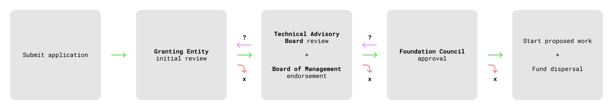

# Review Process

All applications submitted to the Interchain Foundation 
Funding Program undergo a multi-stakeholder evaluation 
process to ensure ICF support aligns with its 
mission. This document summarizes the
sequence in which proposals are processed. Review may be 
discontinued or Applicants asked to revise their 
proposal at any point until a contract has been finalized.

## Granting Entities

Upon submission, the **Granting Entities**, 
[Interchain GmbH](https://interchain.berlin/) and 
[Informal](https://informal.systems/), will assess whether the
application is complete and meets the criteria 
for eligibility.

Granting Entities will then perform an initial review using the
following [evaluation criteria](./evaluation_criteria.md),
soliciting additional peer review where appropriate.

Granting Entities may then choose to sponsor applications for 
further consideration, matching them with a **Steward** who will serve
as the Applicant's primary point of contact.

Once assigned, Stewards will setup an initial call with the Applicant
to clarify outstanding questions about their submission and revise
the proposed scope, timeline, and budget as needed. Together they 
will draft a prospective **Financing Agreement**, which will used as 
the basis for subsequent evaluation.

## Board of Management & Technical Advisory Committee

The draft Financing Agreement, together with Granting Entity reviews
and the original application, are delivered to the **Board of
Management**, a supervisory body employed by the Interchain Foundation.

The Board of Management will administer the assembly of a **Technical
Advisory Committee**, composed of domain experts with a proven record
of community contribution. This committee will provide feedback
on each proposal's technical soundness and benefit to the wider
ecosystem.

The Board of Management will then incorporate feedback from the 
Technical Advisory Committee with all previous materials to create
a final package which will be unanimously endorsed by the Board of
Managment or otherwise returned to Stewards with revising comments.

## Foundation Council

Endorsed application packages are then sent to the 
**Foundation Council**, who will either give final 
approval or exercise their veto. Given the 
extent of prior due diligence, the Foundation Council should 
provide a strong justification to deny final approval.

## Common Reasons a Proposal is *Not* Funded

- Incomplete Scope, Budget, or Timeline
- Asking amount is too high
- Timing (too early for Interchain Foundation consideration)
- Previously supported redundant efforts
- Not relevant to Interchain Foundation mandate
